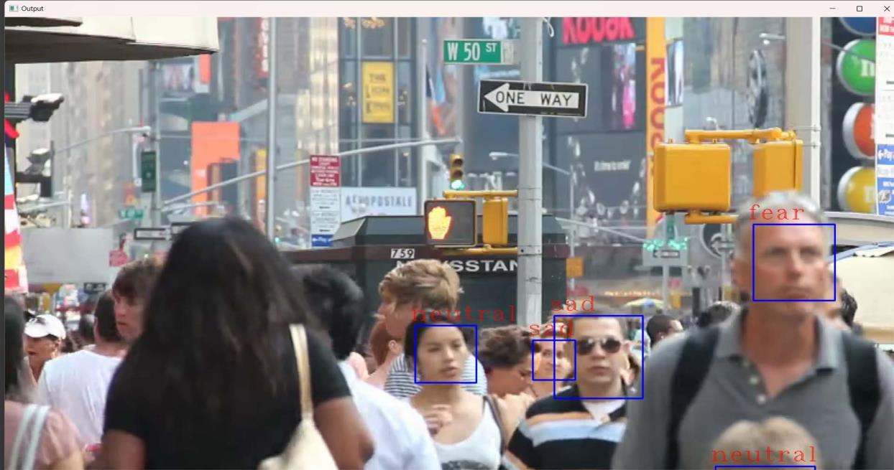

# MoodDetection



A real-time facial emotion detection system using Convolutional Neural Networks (CNNs) and computer vision techniques. The system captures facial expressions from live video streams or recorded files and accurately classifies emotions using deep learning models.

## Overview

This project implements a sophisticated emotion recognition system capable of detecting six primary emotions (angry, fear, happy, neutral, sad, surprise) in real-time video streams. The system uses a custom-trained CNN model with 89% accuracy and integrates with OpenCV for face detection.

## Features

- Real-time emotion recognition from webcam feed
- Video file analysis and processing
- Interactive GUI with dynamic background effects
- Emotion tracking and logging with timestamps
- Pre-trained CNN model with high accuracy
- Comprehensive emotion statistics and reporting

## Performance Metrics

- **Model Accuracy**: 89% on test dataset after 400 epochs training
- **Training Dataset**: 28,385 images across 6 emotion classes
- **Test Dataset**: 6,955 validation images
- **Real-time Processing**: Optimized for 30+ FPS performance
- **Model Architecture**: 4 convolutional layers + 2 dense layers

## Installation

### Prerequisites

- Python 3.9-3.11
- Webcam for real-time detection
- CUDA-enabled GPU (optional, for acceleration)

### Setup

1. Clone the repository:
```bash
git clone https://github.com/samyak0510/MoodDetection.git
cd MoodDetection
```

2. Download the dataset:
   - Visit: https://www.kaggle.com/datasets/jonathanoheix/face-expression-recognition-dataset/data
   - Download and extract the dataset
   - Place the extracted `images` folder with `train` and `test` subdirectories in the project root

3. Install dependencies:
```bash
pip install -r requirements.txt
```

4. Train the model (optional):
   - Open and run `trainmodel.ipynb` in Jupyter Notebook
   - This will generate `emotiondetector.h5` and `emotiondetector.json` files

5. Run the application:
```bash
python realtimedetection.py
```

## Usage

### Real-time Detection
1. Launch the application
2. Click "Start Webcam" for live emotion detection
3. The system displays bounding boxes around detected faces with emotion labels
4. Results are automatically logged with timestamps

### Video Analysis
1. Click "Select Video File" in the GUI
2. Choose your video file (MP4, AVI formats supported)
3. The system processes the video frame by frame
4. Results are displayed with emotion overlays

## Model Architecture

The CNN model consists of:
- **Input Layer**: 48x48 grayscale images
- **4 Convolutional Blocks**: 128, 256, 512, 512 filters with MaxPooling and Dropout
- **2 Dense Layers**: 512 and 256 neurons with regularization
- **Output Layer**: 6 neurons with softmax activation for emotion classification

### Training Details
- **Optimizer**: Adam with adaptive learning rate
- **Loss Function**: Categorical cross-entropy
- **Training Progress**: 55% (10 epochs) → 80% (100 epochs) → 89% (400 epochs)
- **Regularization**: Dropout layers to prevent overfitting

## Technical Specifications

### Data Processing Pipeline
1. Face detection using Haar cascade classifiers
2. Image preprocessing (resize to 48x48, grayscale conversion, normalization)
3. Feature extraction through CNN layers
4. Emotion classification with confidence scoring
5. Result logging and statistical analysis

### System Requirements
- **Memory**: 8GB+ RAM recommended
- **Storage**: 2GB for model and dependencies
- **GPU**: CUDA-enabled GPU for optimal performance
- **OS**: Windows, macOS, Linux compatible

## Dataset

The emotion recognition model requires a comprehensive facial expression dataset:

- **Source**: [Face Expression Recognition Dataset](https://www.kaggle.com/datasets/jonathanoheix/face-expression-recognition-dataset/data)
- **Size**: 35,340 total images (28,385 training + 6,955 testing)
- **Classes**: 6 emotions (angry, fear, happy, neutral, sad, surprise)
- **Format**: 48x48 grayscale images
- **Structure**: 
  ```
  images/
  ├── train/
  │   ├── angry/
  │   ├── fear/
  │   ├── happy/
  │   ├── neutral/
  │   ├── sad/
  │   └── surprise/
  └── test/
      ├── angry/
      ├── fear/
      ├── happy/
      ├── neutral/
      ├── sad/
      └── surprise/
  ```

**Note**: The dataset is not included in this repository due to size constraints. Please download it from the Kaggle link above.

## Project Structure

```
MoodDetection/
├── images/                  # Demo screenshots showing working application
├── realtimedetection.py     # Main application with GUI
├── trainmodel.ipynb         # Model training notebook
├── requirements.txt         # Python dependencies
├── docs/                    # Project reports and documentation
├── .gitignore              # Git ignore rules
└── LICENSE                 # MIT License
```

**Generated after training:**
- `emotiondetector.h5` - Trained model weights (~49MB)
- `emotiondetector.json` - Model architecture
- `recorded_emotions.txt` - Emotion detection logs

## Documentation

- **[Complete Project Report](docs/Samyak%20final%20report.pdf)** - Detailed academic report with methodology, results, and analysis
- **Training Notebook**: `trainmodel.ipynb` - Complete model training process with visualizations
- **Performance Analysis**: Detailed metrics and benchmark results included in the report

## Results and Performance

The system demonstrates strong emotion recognition capabilities:

- **High Accuracy**: 89% classification accuracy on diverse test dataset
- **Real-time Performance**: Processes video streams at 30+ FPS
- **Robust Detection**: Effective face detection across various lighting conditions
- **Emotion Distribution**: Balanced performance across all six emotion classes

## Applications

- **Human-Computer Interaction**: Adaptive interfaces based on user emotional state
- **Mental Health Assessment**: Real-time mood monitoring and analysis
- **Marketing Research**: Customer sentiment analysis in retail environments
- **Educational Technology**: Emotion-aware learning systems
- **Security Systems**: Enhanced surveillance with behavioral analysis

## Technology Stack

- **Deep Learning**: TensorFlow/Keras for CNN implementation
- **Computer Vision**: OpenCV for image processing and face detection
- **GUI Framework**: Tkinter for user interface
- **Data Processing**: NumPy, Pandas for data manipulation
- **Visualization**: Matplotlib for result plotting and analysis

## Development

### Model Training
The CNN model was trained on a comprehensive facial expression dataset with the following specifications:
- **Architecture**: Sequential CNN with progressive filter increase
- **Preprocessing**: Grayscale conversion, normalization, data augmentation
- **Validation**: Separate test set for unbiased performance evaluation
- **Optimization**: Adam optimizer with categorical cross-entropy loss

### Performance Optimization
- **GPU Acceleration**: CUDA support for faster inference
- **Memory Management**: Efficient batch processing and memory cleanup
- **Real-time Processing**: Optimized pipeline for minimal latency
- **Error Handling**: Comprehensive exception handling and logging

## Academic Context

This project was developed as part of the Computer Engineering curriculum at Indus University under the supervision of Prof. Sanjay Prajapati. The work represents a practical implementation of deep learning techniques for emotion recognition with real-world applications.

## License

This project is licensed under the MIT License - see the [LICENSE](LICENSE) file for details.

## Acknowledgments

- **Academic Supervision**: Prof. Sanjay Prajapati, Indus University
- **Dataset Source**: Kaggle facial expression datasets
- **Technical Framework**: TensorFlow/Keras and OpenCV communities
- **Institution**: Indus Institute of Technology and Engineering

---

**Author**: Samyak Bijal Shah (IU2041050110)  
**Institution**: Indus University, Ahmedabad  
**Year**: 2024 